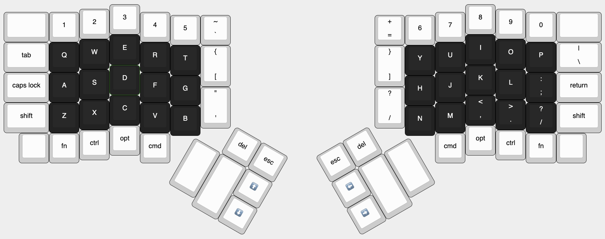
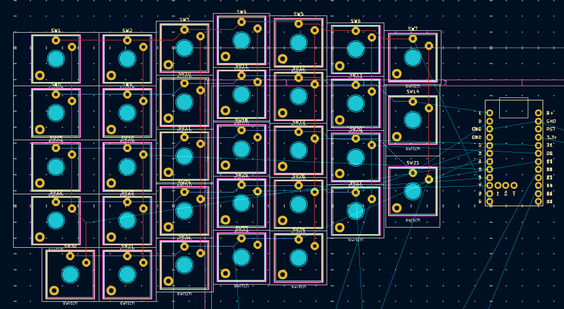

# Journal
Documents my progress designing the 80% Dodge.

# May 25
2 hours
Made layout by looking at similarly designed dished keyboards to see how I could replicate that effect in a non-dished keyboard. I wanted to ensure that this would be relatively comfortable so I made sure to print out the layout on paper to see how it felt based on my hand and how I type. I liked the addition of the thumb cluster as I felt it allowed for better use of it since I don't normally use my thumb for modifier keys.

# May 26
1 hour
Began routing the PCB for the left hand. Will likely join the 2 and cut them later to save on assembly costs.
(worked during the zoom meeting)
